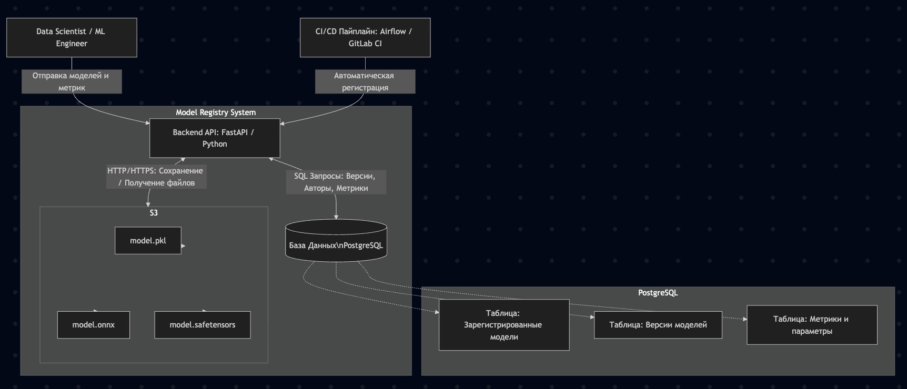

## Анализ существующих проблем

- Отсутствие метаданных: По названию папки/модели нельзя определить параметры модели, метрики и точный датасет, на котором она обучалась
- Отсутствие управления жизненным циклом: Нет понимания какая из моделей находится в продакшене, какая на стадии тестирования, а какая участвует в АБ тесте. Также неизвестно, кто автор конкретной сборки
- Единая точка отказа (SPOF) и низкая надежность: Все модели хранятся на диске одной машинки. Если диск выйдет из строя или кто-то удалит директорию, результаты работы будут потеряны
- Невоспроизводимость: Отсутствует связь артефакта с конкретным коммитом в гите
- Потеря зависимостей окружения: В случае несовпадения версий библиотек (sklearn, torch etc) может возникнуть проблема с загрузкой модели
- Раздувание хранилища: В папках копятся эксперименты без контроля их полезности

## Требования к системе

### Функциональные требования

- Система должна надежно хранить артефакты моделей различных форматов (например, onnx, pickle, model.safetensors)
- Обеспечение загрузки модели в хранилище и отдачи модели по запросу
- Поддержка строгого версионирования моделей
- Связывание каждой версии модели с источником, датасетом, параметрами обучения и полученными метриками
- Отслеживание и изменение этапов жизненного цикла (prod/stage/ab)
- Фиксация автора, типа модели и даты создания
- Фиксация зависимостей окружения (например, загрузка requirements.txt вместе с артефактом) и контрактов входов/выходов модели

### Нефункциональные требования

- Надежность и отсутствие SPOF: Модели не должны теряться, хранилище должно гарантировать сохранность данных за счет избыточности
- Масштабируемость: Система должна выдерживать рост числа хранимых моделей без деградации или необходимости ручной перенастройки оборудования
- Доступность и производительность: Обеспечение быстрого доступа к артефактам и метаданным
- Безопасность: Реализация ролевой модели доступа для защиты от несанкционированного изменения или удаления
- Эксплуатация: Наличие метрик и мониторинга состояния самой системы
- Наличие аудита логов для отслеживания того, кто перевел модель в Prod, и поддержки политик автоматической очистки старых неиспользуемых экспериментов

## Архитектура системы и выбор технологий

Для реализации отказоустойчивой архитектуры мы разделяем хранение тяжелых бинарей и структурированных метаданных

### Компоненты системы

1. Хранилище артефактов - S3 (minio). S3 является стандартом индустрии для облачного хранения данных. Оно решает проблему масштабируемости, так как не имеет иерархической структуры и не требует перенастройки оборудования при росте объемов данных. S3 решает проблему SPOF, гарантируя надежность за счет избыточности хранения объектов в нескольких узлах. Также S3 поддерживает доступ по HTTP/HTTPS API и управление правами доступа
2. БД метаданных - Postgres. Реляционная БД идеально подходит для хранения четко структурированных метаданных. Она позволяет выполнять быстрые поисковые запросы и строить связи между семейством моделей, их версиями и соответствующими метриками
3. Бэкенд сервис - FastAPI. Служит прослойкой и точкой входа. Инкапсулирует бизнес-логику работы с хранилищем, защищает S3 от прямого доступа пользователей, валидирует данные, реализует ролевую модель безопасности и предоставляет REST API для автоматизации процессов

## Проектирование API и схемы БД

#### Схема БД:

Таблица `registered_models`:

- id: int (PK). Идентификатор
- name: String (unique). Имя модели
- description: Text. Описание модели
- created_at: Timestamp.

Таблица `model_versions`:

- id: int (PK). Идентификатор версии
- model_id: int (FK). Ссылка на `registered_models.id`
- version_number: int. Номер версии
- created_by_id: int (FK). Ссылка на `users.id`
- source: String. Ссылка на git commit или пайплайн
- dataset_reference: String. Ссылка на датасет
- current_stage: Enum. Статус (None, Stage, Prod, AB, Archived)
- s3_artifact_uri: String. Путь до модели в S3
- created_at: Timestamp.

Таблица `model_metrics`:

- id: int (PK). Идентификатор
- version_id: int (FK). Ссылка на `model_versions.id`
- key: String. Название метрики (например `roc-auc`, `f1` etc)
- value: Float. Значение метрики

Таблица `model_parameters`:

- id: int (PK). Идентификатор
- version_id: int (FK). Ссылка на `model_versions.id`
- key: String. Название параметра (например `learning_rate`, `weight_decay` etc)
- value: String. Значение параметра

Таблица `state_transitions`:

- id: int (PK). Идентификатор
- version_id: int (FK). Ссылка на `model_versions.id`
- from_stage: String. Из какого статуса
- to_stage: String. В какой статус
- actor_id: int (FK). Ссылка на `users.id`
- reason: String. Обоснование перевода
- created_at: Timestamp.

Таблица `users`:

- id: int (PK)
- username: String (unique)
- email: String (unique)
- hashed_password: String
- role: Enum (ADMIN, DEVELOPER, USER)
- is_active: Boolean

#### Дизайн API

1. Управление моделями

- `POST /api/v1/models` - Создает новое семейство моделей

Параметры: name: String - уникальное имя модели, description: Optional[String] - текстовое описание модели

- `GET /api/v1/models` - Возвращает список всех зарегистрированных моделей в системе (ADMIN or DEVELOPER)

Параметры: limit: Optional[int] - максимальное число возвращаемых моделей, offset: Optional[int] - смещение

- `GET /api/v1/models/{model_name}` - Возвращает детальную информацию по конкретному семейству

Параметры: model_name: String - имя искомой модели

2. Управление версиями и метаданными

- `POST /api/v1/models/{model_name}/versions` - Регистрирует новую версию и загружает артефакт в S3 (ADMIN or DEVELOPER)

Параметры: model_name: String - имя модели, file: binary - файл весов модели (onnx, pickle etc), source: Optional[String] - ссылка на гит коммит или пайплайн обучения, dataset_reference: Optional[String] - ссылка на датасет, metrics: Optional[String] - JSON строка со словарем метрик, parameters: Optional[String] - JSON строка со словарем гиперпараметров

- `GET /api/v1/models/{model_name}/versions` - Возвращает список всех версий для конкретной модели

Параметры: model_name: String - имя модели, stage: String - фильтр по статусу

- `GET /api/v1/versions/{version_id}` - Возвращает полную информацию о версии, включая массивы её метрик и параметров из смежных таблиц

Параметры: version_id: int - идентификатор версии

3. Аудит и жизненный цикл

- `POST /api/v1/versions/{version_id}/transitions` - Инициирует безопасный перевод модели в новый статус (ADMIN or DEVELOPER)

Параметры: version_id: int - идентификатор версии, target_stage: String - целевой статус, reason: Optional[String] - обоснование

- `GET /api/v1/versions/{version_id}/transitions` - Возвращает историю изменений статусов для конкретной версии

Параметры: version_id: int - идентификатор версии

4. Работа с артефактами (S3)

- `GET /api/v1/versions/{version_id}/download` - Безопасное скачивание модели

Параметры: version_id: int - идентификатор версии

5. Auth API

- `POST /api/v1/auth/token` - Авторизация пользователя по логину/паролю и выдача access token

Параметры: username: String - логин, password: String - пароль

- `POST /api/v1/users` - Регистрация новых пользователей (только ADMIN)

Параметры: username: String - уникальный логин, email: String, password: String, role: Enum